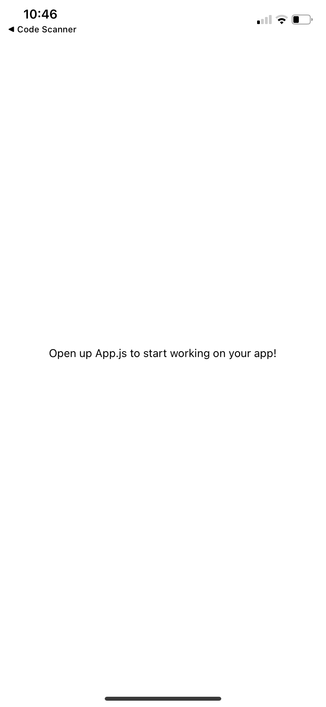
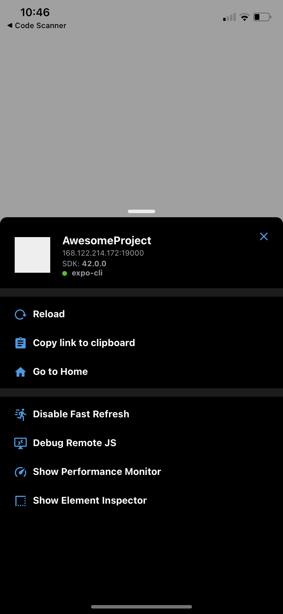

# Log file for SW Mini Project progress

## September 7, 2021

Tony read through some React Native documentation, starting from [Introduction](https://reactnative.dev/docs/getting-started) to [Setting up the development environment](https://reactnative.dev/docs/environment-setup). This includes running the `AwesomeProject` tutorial project on his phone. See images below.

