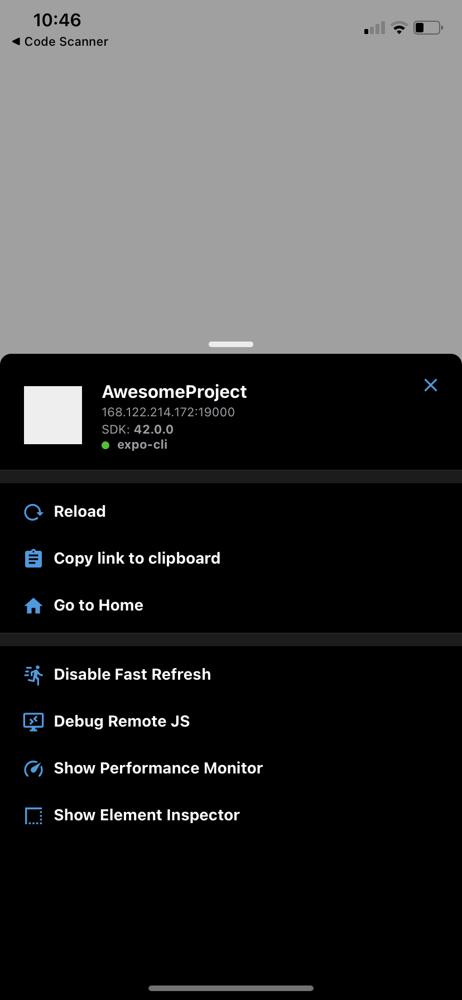

# Log file for SW Mini Project progress

## September 7, 2021

Tony read through some React Native documentation, starting from [Introduction](https://reactnative.dev/docs/getting-started) to [Setting up the development environment](https://reactnative.dev/docs/environment-setup). This includes running the `AwesomeProject` tutorial project on his phone. See images below.

## September 8, 2021

Yuxuan inits this project with `expo` `minimum app` preset and `README.md`

Tony added a hardcoded function to retrieve product data from the FDA API. This simply prints the returned JSON string to the web page.

## September 9, 2021

Tony began learning how to use Firebase. He tried to follow [one tutorial](https://rnfirebase.io/) then [another](https://docs.expo.dev/guides/setup-native-firebase/), but he was unsuccessful. When he tried to launch the app, the emulators refused to connect to the server.

Tony also modified the FDA API function to be more generic and not hard coded.

## September 10, 2021

Tony struggled to get Firebase working. He followed instructions and believes the appropriate Firebase SDKs are installed in the app, but when actually trying to make an API call, an error pops up that says `Error: You attempted to use a firebase module that's not installed in your Android project  by calling firebase.app().` [This is not a new bug](https://github.com/invertase/react-native-firebase/issues/977), so he will continue searching for a solution.

Tony attempted to implement [authenticaion](https://rnfirebase.io/auth/usage) and [database](https://rnfirebase.io/database/usage), but neither was successful.
